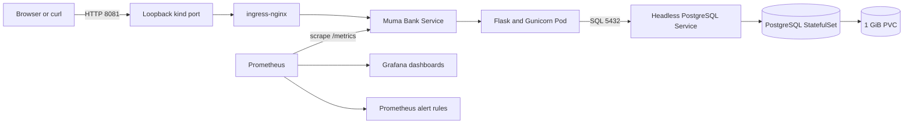
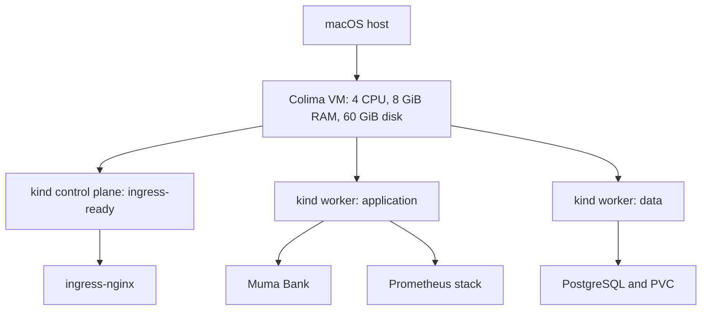
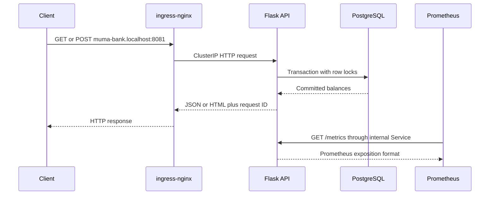
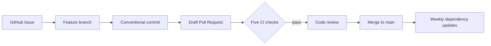

# Platform architecture

Muma Bank is a local, multi-node Kubernetes learning platform designed to demonstrate application delivery, infrastructure as code, persistence, security, CI, observability, and operations as one coherent system.

## Components

All host exposure is bound to loopback. The application is available at `http://muma-bank.localhost:8081`; PostgreSQL, Prometheus, and Grafana remain ClusterIP-only and require explicit local port-forwarding.

## Cluster topology

The scheduler may move ordinary workloads because the labels are educational placement hints, not mandatory affinity rules. PostgreSQL storage is node-local to the kind environment.

## Request and data flow

Transfers lock both account rows in deterministic order and commit the debit and credit atomically. The PVC preserves database files across PostgreSQL Pod recreation.

## Delivery flow

CI performs Python tests, Terraform validation, ShellCheck, Gitleaks, and Trivy scanning with read-only repository permissions. Deployment remains a deliberate local operator action.

## Trust boundaries

- The Mac-to-cluster boundary is loopback-only.
- ingress-nginx is the only intended application entry point.
- dedicated ServiceAccounts receive no RBAC grants or mounted tokens.
- Kubernetes Secrets hold generated database and Grafana credentials; Terraform state remains local and ignored.
- NetworkPolicies describe default-deny intent, but the preserved kindnet CNI does not enforce them. See [network security](network-security.md).
